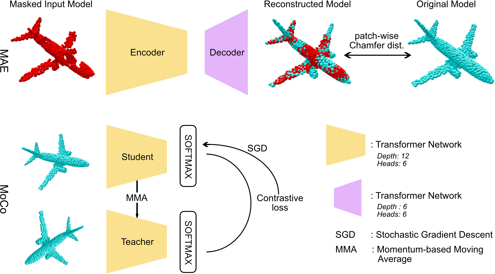

# Explainable Transformer in Point Clouds
## A deep dive into explainable self-supervised transformers for point clouds

*Abstract* — In this paper we delve into the properties of trans-
formers, attained through self-supervision, in the point cloud
domain. Specifically, we evaluate the effectiveness of Masked
Autoencoding as a pretraining scheme, and explore Momentum
Contrast as an alternative. In our study we investigate the impact
of data quantity on the learned features, and uncover similarities
in the transformer’s behavior across domains. Through compre-
hensive visualizations, we observe that the transformer learns
to attend to semantically meaningful regions, indicating that
pretraining leads to a better understanding of the underlying
geometry. Moreover, we examine the finetuning process and its
effect on the learned representations. Based on that, we devise an
unfreezing strategy which consistently outperforms our baseline
without introducing any other modifications to the model or
the training pipeline, and achieve state-of-the-art results in the
classification task among transformer models.

*Index Terms* — Deep Learning, Transformers, Explainability,
Point Clouds, Self-Supervision

<div align="center">
    
</div>

*The code will be made publically available after publication.*

## 1. Requirements

### - Step 1:

Use either anaconda or pip to install the requirements 

 - Anaconda: 

       conda .... conda_requirements.txt


 - pip:

       pip install requirements.txt


### - Step 2:

Manual installation of the following dependancies:

1. Clone and install the chamfer distance from PointMAE original repo.
```
# Go to the extensions subfolder
cd extensions
# initialize a github repository
git init
# add PointMAE repo as remote
git remote add -f origin https://github.com/Pang-Yatian/Point-MAE.git 
# set up the sparse checkout by running (requires git version > 1.7.0)
git config core.sparseCheckout true
# configure the folder that we want to checkout
echo "extensions/chamfer_dist" >> .git/info/sparse-checkout
# pull from the remote
git pull origin main

# Install the module
cd chamfer_dist
python setup.py install --user

# Return to main repo 
cd ..
cd ..
```

2. Install PointNet++ utils

```
pip install "git+https://github.com/erikwijmans/Pointnet2_PyTorch.git#egg=pointnet2_ops&subdirectory=pointnet2_ops_lib"
```
3. Install GPU kNN
```
pip install --upgrade https://github.com/unlimblue/KNN_CUDA/releases/download/0.2/KNN_CUDA-0.2-py3-none-any.whl
```

## 2. Datasets
In this work we use ModelNen40, ScanObjectNN, ShapeNet, and CC3D. See DATASET.md for more details on how to download and set the datasets. 


